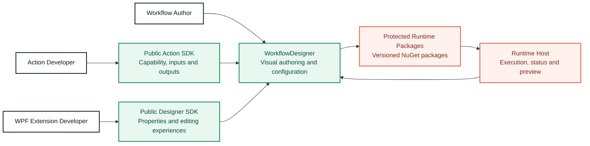

# WorkflowDesigner

[简体中文](README.md) · [English](README.en.md) · **[Open the interactive SDK guide](https://leizhou-dip-ing.github.io/WorkflowDesigner/sdk-guide/)**

WorkflowDesigner is a WPF desktop designer for visual automation workflow authoring. Collaborators can improve the canvas, editing experience, sample plugins, and public SDK integrations without access to the private WorkflowCore source repository.

> This repository contains the Designer, samples, and public extension integration only. The execution core is consumed through protected NuGet packages. Do not add private WorkflowCore or SDK source projects here.

## Architecture at a glance



The diagram intentionally describes only the public collaboration boundary. It does not disclose Core algorithms, storage structures, protection mechanisms, or implementation details.

## Where you can contribute

| Area | Typical work | Main location |
| --- | --- | --- |
| Designer UI | Canvas, docking, property panel, and editor experience | [`src/WorkflowDesigner`](src/WorkflowDesigner) |
| External Actions | Add drag-and-drop workflow capabilities through the public SDK | [`samples/WorkflowRuntime.SampleActionPlugin`](samples/WorkflowRuntime.SampleActionPlugin) |
| Vision Actions | OpenCV Actions, previews, and image workflow examples | [`samples/WorkflowRuntime.OpenCvSamplePlugin`](samples/WorkflowRuntime.OpenCvSamplePlugin) |
| Designer extensions | Optional UI, property editors, workspaces, and double-click editors in one DLL | [`samples/WorkflowRuntime.OpenCvSamplePlugin/UI`](samples/WorkflowRuntime.OpenCvSamplePlugin/UI) |
| Quality | Public contracts, UI behavior, and architecture boundary tests | [`tests/WorkflowCore.WpfDemo.Tests`](tests/WorkflowCore.WpfDemo.Tests) |

## Extension SDK field guide

[](https://leizhou-dip-ing.github.io/WorkflowDesigner/sdk-guide/)

**[Open the bilingual Web PPT in your browser](https://leizhou-dip-ing.github.io/WorkflowDesigner/sdk-guide/)**

The guide uses real samples from this repository to explain both external Action modes, property metadata, plugin registration and deployment, the generated property panel, custom property editors, selected-Action workspaces, double-click editors, and the complete OpenCV extension example.

The deck includes live Chinese/English switching, keyboard navigation, and direct links to every source example.

## Repository owner: one-time onboarding

Inviting someone to WorkflowDesigner alone may not authorize private package restore. Before the developer clones the repository:

1. Invite them under WorkflowDesigner `Settings > Collaborators` and have them accept.
2. Open every private Workflow package used by this repository under the `LeiZhou-Dip-Ing` account.
3. Grant the same account `Read` under each package's `Package settings > Manage access`, or connect the package to WorkflowDesigner and inherit repository access.
4. Never share your token. Every developer creates their own.

Official references: [package access control](https://docs.github.com/en/packages/learn-github-packages/configuring-a-packages-access-control-and-visibility) · [NuGet registry authentication](https://docs.github.com/en/packages/working-with-a-github-packages-registry/working-with-the-nuget-registry)

## Invited developer: first run

### 1. Prerequisites and clone

Use Windows 10/11, Visual Studio 2022 with the .NET desktop workload or .NET SDK 8+, Git, and the GitHub account that accepted the repository invitation.

```powershell
git clone https://github.com/LeiZhou-Dip-Ing/WorkflowDesigner.git
cd WorkflowDesigner
```

### 2. Create your package token

GitHub's NuGet registry currently requires a **Personal Access Token (classic)** for this flow. Go to `Settings > Developer settings > Personal access tokens > Tokens (classic)`, generate a token with a reasonable expiry and `read:packages`, and authorize SSO when required. Never commit the token.

### 3. Activate private WorkflowCore 2.0 package access

There is no separate product license key. “Activating WorkflowCore” means that the owner granted package Read access and the developer configures local NuGet authentication with their own token.

```powershell
.\bootstrap.ps1 -ConfigurePackages
```

The token prompt is hidden. The script stores the credential only in the current Windows user's NuGet configuration, then restores and builds the solution. On later runs use `.\bootstrap.ps1`.

### 4. Start the Runtime Host

Terminal 1:

```powershell
dotnet run --project src\WorkflowRuntime.WindowsService
```

Open [http://localhost:5197/swagger](http://localhost:5197/swagger) and keep the Runtime running.

### 5. Start the Designer

Terminal 2:

```powershell
dotnet run --project src\WorkflowDesigner
```

The Designer connects to `http://localhost:5197/` by default. Set `WORKFLOW_RUNTIME_URL` before launch for another host. Verify that Runtime is connected, the live Action catalog loads, and the sample Actions appear.

### Restore troubleshooting

| Symptom | Likely cause | Fix |
| --- | --- | --- |
| `401 Unauthorized` | Expired/wrong token or not a classic PAT | Generate a PAT (classic) with `read:packages` and reconfigure the source |
| `403 Forbidden` | Account lacks package Read access or SSO authorization | Ask the owner to check every package's Manage access; authorize SSO if applicable |
| `NU1101` | Source missing/disabled or package version unpublished | Run `.\bootstrap.ps1 -ConfigurePackages` and check `Directory.Build.props` |
| Runtime has no sample Actions | Plugin not deployed or Runtime not restarted | Rebuild, inspect the Runtime output `plugins` directory, and restart Runtime |
| Designer stays offline | Runtime is stopped or URL differs | Check Swagger first, then `WORKFLOW_RUNTIME_URL` |

To replace stale credentials:

```powershell
dotnet nuget remove source github-workflow
.\bootstrap.ps1 -ConfigurePackages
```

## SDK examples beyond image processing

[`samples/WorkflowRuntime.SampleActionPlugin`](samples/WorkflowRuntime.SampleActionPlugin) now includes runnable examples for basic metadata and I/O, multi-output text analysis, enum/checkbox/number editors, structured JSON, cancellable asynchronous execution, run variables, and direct `IWorkflowActionHandler` registration.

The current public SDK covers metadata, properties, inputs/outputs, generated editors, variable expressions, output bindings, cancellation, run variables, and optional WPF editing surfaces. Useful next additions include first-class secret fields, HTTP/database/file/message-queue samples, structured validation errors, plugin templates and compatibility tests, and non-vision custom editor examples.

## Build and test

```powershell
dotnet restore WorkflowDesigner.sln
dotnet build WorkflowDesigner.sln -c Release -m:1
dotnet test tests\WorkflowCore.WpfDemo.Tests\WorkflowCore.WpfDemo.Tests.csproj -c Release
```

## Public extension boundary

- Ordinary Runtime Action plugins reference only `WorkflowSdk`; metadata generates the property panel.
- Advanced plugins that need custom WPF can additionally reference `WorkflowWpfSdk` in the same project and ship one DLL to both hosts.
- Designer plugins edit public property models through `IWorkflowDesignerActionContext`; they do not depend on `MainWindowViewModel` or Runtime Action CLR instances.
- Runtime and Designer remain independently deployable and connect through stable public contracts.
- WorkflowCore source remains private. UI collaborators neither need nor should receive Core repository access.

Before making an extension, read the [SDK Web PPT](https://leizhou-dip-ing.github.io/WorkflowDesigner/sdk-guide/) and the relevant sample README.
