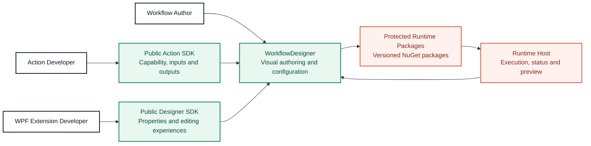
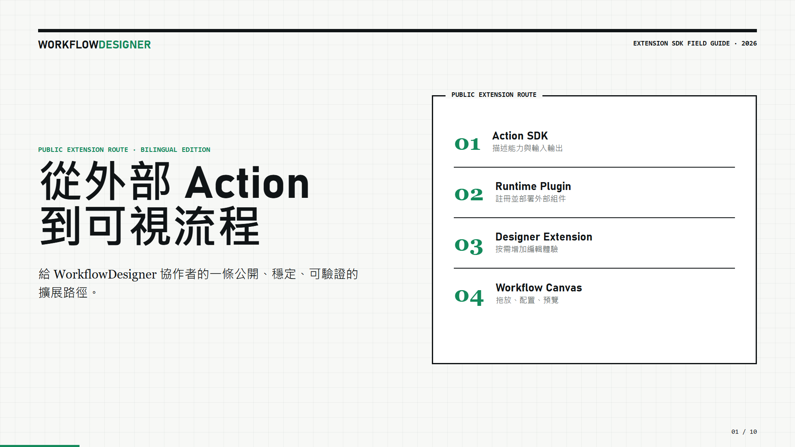

# WorkflowDesigner

[繁體中文](README.md) · [English](README.en.md) · **[Open the interactive SDK guide](https://leizhou-dip-ing.github.io/WorkflowDesigner/sdk-guide/)**

WorkflowDesigner is a WPF desktop designer for visual automation workflow authoring. Collaborators can improve the canvas, editing experience, sample plugins, and public SDK integrations without access to the private WorkflowCore source repository.

> This repository contains the Designer, samples, and public extension integration only. The execution core is consumed through protected NuGet packages. Do not add private WorkflowCore or SDK source projects here.

## Architecture at a glance



The diagram intentionally describes only the public collaboration boundary. It does not disclose Core algorithms, storage structures, protection mechanisms, or implementation details.

## Where you can contribute

| Area | Typical work | Main location |
| --- | --- | --- |
| Designer UI | Canvas, docking, property panel, and editor experience | [`src/WorkflowDesigner`](src/WorkflowDesigner) |
| External Actions | Add drag-and-drop workflow capabilities through the public SDK | [`samples/WorkflowRuntime.SampleActionPlugin`](samples/WorkflowRuntime.SampleActionPlugin) |
| Vision Actions | OpenCV Actions, previews, and image workflow examples | [`samples/WorkflowRuntime.OpenCvSamplePlugin`](samples/WorkflowRuntime.OpenCvSamplePlugin) |
| Designer extensions | Custom property editors, workspaces, and double-click editors | [`samples/WorkflowRuntime.OpenCvSamplePlugin.Designer.Wpf`](samples/WorkflowRuntime.OpenCvSamplePlugin.Designer.Wpf) |
| Quality | Public contracts, UI behavior, and architecture boundary tests | [`tests/WorkflowCore.WpfDemo.Tests`](tests/WorkflowCore.WpfDemo.Tests) |

## Extension SDK field guide

[](https://leizhou-dip-ing.github.io/WorkflowDesigner/sdk-guide/)

**[Open the bilingual Web PPT in your browser](https://leizhou-dip-ing.github.io/WorkflowDesigner/sdk-guide/)**

The guide uses real samples from this repository to explain both external Action modes, property metadata, plugin registration and deployment, the generated property panel, custom property editors, selected-Action workspaces, double-click editors, and the complete OpenCV extension example.

The deck includes live Chinese/English switching, keyboard navigation, and direct links to every source example.

## Developer setup

Collaborators need read access to this repository, package-level read access to private GitHub Packages published by `LeiZhou-Dip-Ing`, and a GitHub Personal Access Token used only for package restore.

```powershell
.\bootstrap.ps1
dotnet restore WorkflowDesigner.sln
dotnet build WorkflowDesigner.sln -c Release
dotnet test tests\WorkflowCore.WpfDemo.Tests\WorkflowCore.WpfDemo.Tests.csproj -c Release
```

Store the token only in the developer's user-level NuGet configuration. Never commit it.

## Public extension boundary

- Runtime Action plugins reference `WorkflowSdk` only.
- Optional WPF Designer plugins reference `WorkflowWpfSdk` only.
- Designer plugins edit public property models through `IWorkflowDesignerActionContext`; they do not depend on `MainWindowViewModel` or Runtime Action CLR instances.
- Runtime and Designer remain independently deployable and connect through stable public contracts.
- WorkflowCore source remains private. UI collaborators neither need nor should receive Core repository access.

Before making an extension, read the [SDK Web PPT](https://leizhou-dip-ing.github.io/WorkflowDesigner/sdk-guide/) and the relevant sample README.

