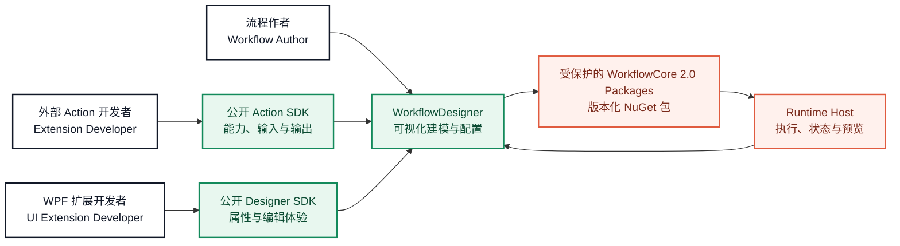

# WorkflowDesigner

[简体中文](README.md) · [English](README.en.md) · **[打开交互式 SDK 教程](https://leizhou-dip-ing.github.io/WorkflowDesigner/sdk-guide/)**

WorkflowDesigner 是一个面向自动化流程建模的 WPF 桌面设计器。协作者可以在不接触私有 WorkflowCore 源码的前提下，改进画布、编辑体验、示例插件与公开 SDK 的使用方式。

> 本仓库只包含 Designer、Runtime Host 壳、示例及公开扩展集成。WorkflowCore 2.0 通过受保护的 NuGet 包提供；请勿将私有 WorkflowCore 或 SDK 源码加入本仓库。

## 一眼看懂架构



这张图只描述公开协作边界：谁使用 Designer、外部能力如何接入、Designer 如何与 Runtime Host 协作。它不公开 Core 的内部算法、存储结构、保护机制或其他实现细节。

## 你可以参与什么

| 领域 | 适合的工作 | 主要位置 |
| --- | --- | --- |
| Designer UI | 画布、停靠窗口、属性面板、编辑器体验 | [`src/WorkflowDesigner`](src/WorkflowDesigner) |
| 外部 Actions | 使用公开 SDK 增加可拖放的流程能力 | [`samples/WorkflowRuntime.SampleActionPlugin`](samples/WorkflowRuntime.SampleActionPlugin) |
| 视觉 Actions | OpenCV Action、预览与图像工作流示例 | [`samples/WorkflowRuntime.OpenCvSamplePlugin`](samples/WorkflowRuntime.OpenCvSamplePlugin) |
| Designer 扩展 | 单 DLL 内的可选 UI、自定义属性编辑器、工作区与双击编辑器 | [`samples/WorkflowRuntime.OpenCvSamplePlugin/UI`](samples/WorkflowRuntime.OpenCvSamplePlugin/UI) |
| 质量保障 | 公开契约、UI 行为与架构边界测试 | [`tests/WorkflowCore.WpfDemo.Tests`](tests/WorkflowCore.WpfDemo.Tests) |

## 扩展 SDK 实战指南

[](https://leizhou-dip-ing.github.io/WorkflowDesigner/sdk-guide/)

**[在浏览器中打开中英双语 Web PPT](https://leizhou-dip-ing.github.io/WorkflowDesigner/sdk-guide/)**

指南使用本仓库的真实示例讲解：

- `WorkflowActionBase` 与 `IWorkflowActionHandler` 两种外部 Action 方式。
- Action metadata、普通属性、输入及输出的声明方法。
- `IWorkflowActionPlugin` 的注册、构建、部署与验证流程。
- 自动生成的基础属性面板。
- `RegisterPropertyEditor` 自定义单个属性编辑器。
- `RegisterWorkspace` 扩展选中 Action 的工作区。
- `RegisterActionEditor` 扩展双击专用编辑器。
- OpenCV 插件如何在一个交付 DLL 内把 Runtime Action 与可选 WPF 体验保持分离。

教程支持中文/英文即时切换、键盘翻页以及每个示例的源码直达链接。

## 仓库所有者：邀请开发者前只做一次

只邀请开发者进入 WorkflowDesigner 仓库还不够。新电脑还原私有包时，GitHub 同时检查“账号是否有包权限”和“Token 是否允许读取包”。你需要：

1. 在 WorkflowDesigner 的 `Settings > Collaborators` 邀请开发者，并让对方接受邀请。
2. 打开 `LeiZhou-Dip-Ing` 账号下本项目使用的每个私有 Workflow 包。
3. 在每个包的 `Package settings > Manage access` 中给该开发者 `Read` 权限；或者把包连接到 WorkflowDesigner 仓库并继承仓库权限。
4. 不要把你的 Token 发给开发者。每个人必须生成自己的 Token。

GitHub 官方说明：[配置包访问权限](https://docs.github.com/en/packages/learn-github-packages/configuring-a-packages-access-control-and-visibility) · [NuGet Registry 身份验证](https://docs.github.com/en/packages/working-with-a-github-packages-registry/working-with-the-nuget-registry)

## 受邀开发者：下载后第一次运行

### 1. 准备环境并克隆

需要 Windows 10/11、Visual Studio 2022（包含“.NET 桌面开发”工作负载）或 .NET SDK 8+、Git，以及已经接受仓库邀请的 GitHub 账号。

```powershell
git clone https://github.com/LeiZhou-Dip-Ing/WorkflowDesigner.git
cd WorkflowDesigner
```

### 2. 生成自己的包读取 Token

当前 GitHub NuGet Registry 要求使用 **Personal Access Token (classic)**：

1. GitHub 右上角头像 > `Settings`。
2. `Developer settings > Personal access tokens > Tokens (classic)`。
3. 选择 `Generate new token (classic)`，设置合理有效期。
4. 勾选 `read:packages`。如果组织启用了 SSO，还要为该 Token 授权 SSO。
5. Token 只显示一次，禁止写入源码、README、项目内 `NuGet.Config` 或提交记录。

### 3. 激活 WorkflowCore 2.0 包访问

这里没有额外的产品许可证码。“激活 WorkflowCore”指仓库所有者已授予包读取权限，并且开发者使用自己的 Token 配置本机 NuGet。

```powershell
.\bootstrap.ps1 -ConfigurePackages
```

Token 输入会隐藏。脚本只把凭据写入当前 Windows 用户的 NuGet 配置，不写入仓库，然后自动执行 restore 和 build。以后通常只需运行 `.\bootstrap.ps1`。

### 4. 启动 Runtime Host

打开第一个终端：

```powershell
dotnet run --project src\WorkflowRuntime.WindowsService
```

打开 [http://localhost:5197/swagger](http://localhost:5197/swagger)。能看到 API 页面表示私有包已成功还原且 Runtime 已启动。保持这个终端运行。

### 5. 启动 Designer

打开第二个终端：

```powershell
dotnet run --project src\WorkflowDesigner
```

Designer 默认连接 `http://localhost:5197/`。连接其他 Runtime 时，在启动前设置 `WORKFLOW_RUNTIME_URL`。首次运行应确认 Designer 显示 Runtime 已连接、Action 列表能加载，并且 `External plugins` 分类能看到示例 Action。

### 包仍然报错时

| 错误现象 | 最常见原因 | 处理方式 |
| --- | --- | --- |
| `401 Unauthorized` | Token 错误、过期或不是 classic Token | 重新生成带 `read:packages` 的 PAT (classic)，删除旧 NuGet source 后重新配置 |
| `403 Forbidden` | 同一个 GitHub 账号没有包 Read 权限或 SSO 未授权 | 让仓库所有者检查每个包的 `Manage access`；组织场景再授权 SSO |
| `NU1101` / 找不到 Workflow 包 | 私有 source 未配置、被禁用或目标版本未发布 | 运行 `.\bootstrap.ps1 -ConfigurePackages`，并核对 `Directory.Build.props` 的版本 |
| Runtime 启动但没有示例 Action | 插件未部署或 Runtime 未重启 | 重新 build，确认 DLL 位于 Runtime 输出的 `plugins` 目录，然后重启 Runtime |
| Designer 一直离线 | Runtime 未启动或地址不一致 | 先检查 Swagger，再检查 `WORKFLOW_RUNTIME_URL` |

更新失效凭据：

```powershell
dotnet nuget remove source github-workflow
.\bootstrap.ps1 -ConfigurePackages
```

## SDK 示例：不只图像处理

[`samples/WorkflowRuntime.SampleActionPlugin`](samples/WorkflowRuntime.SampleActionPlugin) 现在包含多种可运行案例：

| 示例 | 场景 | 展示的 SDK 能力 |
| --- | --- | --- |
| `GreetingAction` | 基础业务 Action | 普通属性、输入、数字范围、输出、图标 |
| `TextMetricsAction` | 多结果文本分析 | 一个输入映射多个输出 |
| `TextTransformAction` | 文本规则处理 | 枚举下拉框、复选框、数字步进、截断状态 |
| `JsonEnvelopeAction` | API/消息数据封装 | JSON 编辑器、结构化输入输出、运行时校验 |
| `DelayAction` | 异步控制 | `async ValueTask`、可取消执行、完成时间输出 |
| `RunCounterAction` | 流程运行状态 | `TryGetVariable` / `SetVariable` 公共上下文 |
| `PingActionHandler` | 最小接口模式 | 直接实现 `IWorkflowActionHandler` 并手动注册 |

OpenCV 示例继续展示图像、预览、自定义属性编辑器、Workspace 和双击编辑器；普通业务 Action 不需要先做 WPF 扩展。

## 当前扩展能力与缺口

当前公开 SDK 已覆盖 Action metadata、属性/输入/输出、基础编辑器、变量表达式、输出绑定、异步取消、运行变量，以及可选 WPF 属性编辑器、Workspace、Action Editor。后续仍值得补充：

- 安全的 Secret/Credential 字段类型，避免敏感值进入普通流程 JSON。
- 标准 HTTP、数据库、文件、消息队列等独立示例插件。
- Action 输入校验错误的结构化呈现，而不只是运行异常。
- 插件模板、兼容性矩阵、版本迁移示例和端到端插件测试工具。
- 非图像领域的 Designer 自定义编辑器案例，例如 SQL、HTTP Header 或映射规则编辑器。

这些属于公开 SDK 与示例丰富度的改进方向，不需要公开 WorkflowCore 内部实现。

## 构建与测试

```powershell
dotnet restore WorkflowDesigner.sln
dotnet build WorkflowDesigner.sln -c Release -m:1
dotnet test tests\WorkflowCore.WpfDemo.Tests\WorkflowCore.WpfDemo.Tests.csproj -c Release
```

## 公开扩展边界

- 普通 Runtime Action 插件只需要引用 `WorkflowRuntime.ActionSdk`，元数据自动生成属性面板。
- 需要自定义 WPF 体验的进阶插件在同一个 csproj 中按需引用 `WorkflowDesigner.WpfSdk`；需要运行期对象句柄与预览时再引用 `WorkflowRuntime.ResourceSdk`。
- 一个第三方 Extension 对应一个 csproj。`Runtime/`、`Designer/`、`Shared/` 只是同一项目内的源码目录，最终输出一个同时供两个宿主加载的 DLL。
- Designer 插件通过 `IWorkflowDesignerActionContext` 操作公开属性模型，不依赖 `MainWindowViewModel` 或 Runtime Action CLR 实例。
- Runtime 与 Designer 保持独立部署；外部插件通过稳定公开契约连接。
- WorkflowCore 源码保持私有。UI 协作者不需要、也不应被授予 Core 仓库权限。

## 访问模型

WorkflowDesigner 源码面向 UI 与设计器协作开放。私有包权限应在 GitHub Packages 中以 package-level `Read` 单独授予，不要依赖 WorkflowCore 仓库权限继承。

开始开发前，请先阅读 [SDK Web PPT](https://leizhou-dip-ing.github.io/WorkflowDesigner/sdk-guide/) 和相应示例的 README。
