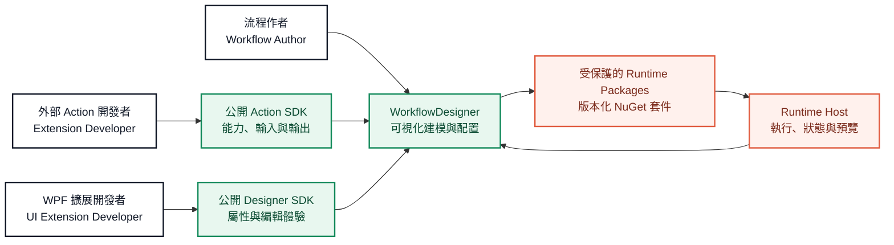

# WorkflowDesigner

[繁體中文](README.md) · [English](README.en.md) · **[開啟互動式 SDK 教學](https://leizhou-dip-ing.github.io/WorkflowDesigner/sdk-guide/)**

WorkflowDesigner 是一個面向自動化流程建模的 WPF 桌面設計器。協作者可以在不接觸私有 WorkflowCore 原始碼的前提下，改進畫布、編輯體驗、示例插件與公開 SDK 的使用方式。

> 本倉庫只包含 Designer、示例及公開擴展集成。執行核心透過受保護的 NuGet 套件提供；請勿將私有 WorkflowCore 或 SDK 原始碼加入此倉庫。

## 一眼看懂架構



這張圖刻意只描述公開協作邊界：誰使用 Designer、外部能力如何接入、Designer 如何與 Runtime Host 協作。它不公開 Core 的內部算法、存儲結構、保護機制或其他實作細節。

## 你可以參與什麼

| 領域 | 適合的工作 | 主要位置 |
| --- | --- | --- |
| Designer UI | 畫布、停靠窗口、屬性面板、編輯器體驗 | [`src/WorkflowDesigner`](src/WorkflowDesigner) |
| 外部 Actions | 使用公開 SDK 增加可拖放的流程能力 | [`samples/WorkflowRuntime.SampleActionPlugin`](samples/WorkflowRuntime.SampleActionPlugin) |
| 視覺 Actions | OpenCV Action、預覽與圖像工作流示例 | [`samples/WorkflowRuntime.OpenCvSamplePlugin`](samples/WorkflowRuntime.OpenCvSamplePlugin) |
| Designer 擴展 | 自訂屬性編輯器、工作區與雙擊編輯器 | [`samples/WorkflowRuntime.OpenCvSamplePlugin.Designer.Wpf`](samples/WorkflowRuntime.OpenCvSamplePlugin.Designer.Wpf) |
| 品質保障 | 公開契約、UI 行為與架構邊界測試 | [`tests/WorkflowCore.WpfDemo.Tests`](tests/WorkflowCore.WpfDemo.Tests) |

## 擴展 SDK 實戰指南

[](https://leizhou-dip-ing.github.io/WorkflowDesigner/sdk-guide/)

**[在瀏覽器中打開中英雙語 Web PPT](https://leizhou-dip-ing.github.io/WorkflowDesigner/sdk-guide/)**

指南以本倉庫的真實示例講解：

- `WorkflowActionBase` 與 `IWorkflowActionHandler` 兩種外部 Action 方式。
- Action metadata、普通屬性、輸入及輸出的聲明方法。
- `IWorkflowActionPlugin` 的註冊、構建、部署與驗證流程。
- 自動生成的基礎屬性面板。
- `RegisterPropertyEditor` 自訂單個屬性編輯器。
- `RegisterWorkspace` 擴展選中 Action 的工作區。
- `RegisterActionEditor` 擴展雙擊專用編輯器。
- OpenCV 插件如何把 Runtime Action 與可選 WPF 體驗保持分離。

簡報支持中文/英文即時切換、鍵盤翻頁以及每個示例的源碼直達鏈接。

## 開發者設置

協作者需要：

1. 本 WorkflowDesigner 倉庫的讀取權限。
2. `LeiZhou-Dip-Ing` 發布的私有 GitHub Packages 讀取權限。
3. 一個僅用於套件還原的 GitHub Personal Access Token。

運行：

```powershell
.\bootstrap.ps1
```

如果尚未配置 GitHub Packages，腳本會輸出需要執行的 `dotnet nuget add source` 命令。Token 只能保存在開發者的用戶級 NuGet 配置中，禁止提交到倉庫。

完成配置後：

```powershell
dotnet restore WorkflowDesigner.sln
dotnet build WorkflowDesigner.sln -c Release
dotnet test tests\WorkflowCore.WpfDemo.Tests\WorkflowCore.WpfDemo.Tests.csproj -c Release
```

## 公開擴展邊界

- Runtime Action 插件只需要引用 `WorkflowSdk`。
- 可選 WPF Designer 插件只需要引用 `WorkflowWpfSdk`。
- Designer 插件透過 `IWorkflowDesignerActionContext` 操作公開屬性模型，不依賴 `MainWindowViewModel` 或 Runtime Action CLR 實例。
- Runtime 與 Designer 保持獨立部署；外部插件透過穩定公開契約連接。
- WorkflowCore 原始碼保持私有。UI 協作者不需要、也不應被授予 Core 倉庫權限。

## 訪問模型

WorkflowDesigner 原始碼面向 UI 與設計器協作開放。私有套件權限應在 GitHub Packages 中以 package-level `Read` 單獨授予，不要依賴 WorkflowCore 倉庫權限繼承。

開始開發前，請先閱讀 [SDK Web PPT](https://leizhou-dip-ing.github.io/WorkflowDesigner/sdk-guide/) 和相應示例的 README。
